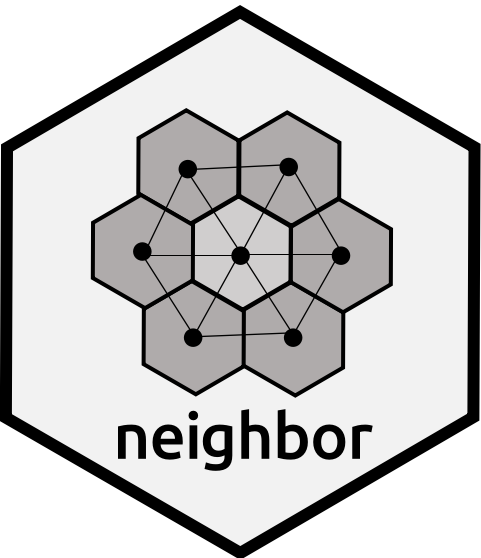
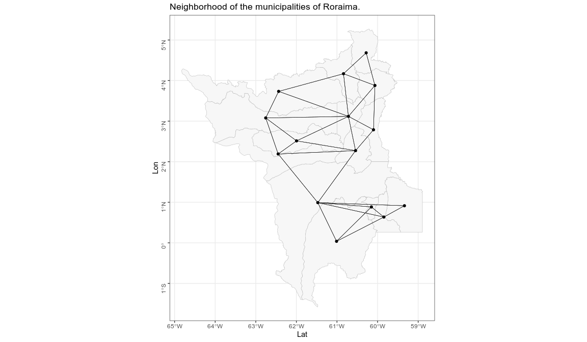
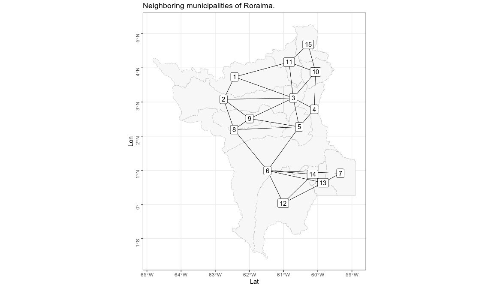

<!-- README.md is generated from README.Rmd. Please edit that file -->

# neighbor <a href='https://www.denis-or.com.br'></a>

<!-- badges: start -->
<!-- badges: end -->

`{neighbor}` gets and visualizes the neighbors of a spatial object (area
objects) that has at least one point (or vertex) in common, but no
intersection. This package uses the `poly2nb` function from the `spdep`
package with the contiguity neighborhood type: queen and rook.

## Installation

And the development version from [GitHub](https://github.com/) with:

``` r
# install.packages("remotes")
remotes::install_github("denis-or/neighbor")
#> Using github PAT from envvar GITHUB_PAT
#> Downloading GitHub repo denis-or/neighbor@HEAD
#> e1071 (1.7-7 -> 1.7-8 ) [CRAN]
#> spdep (1.1-8 -> 1.1-11) [CRAN]
#> Installing 2 packages: e1071, spdep
#> Installing packages into '/home/catoper/R/x86_64-pc-linux-gnu-library/4.0'
#> (as 'lib' is unspecified)
#>      checking for file ‘/tmp/Rtmp5YEz00/remotes3c517c417287/denis-or-neighbor-c23c388/DESCRIPTION’ ...  ✓  checking for file ‘/tmp/Rtmp5YEz00/remotes3c517c417287/denis-or-neighbor-c23c388/DESCRIPTION’
#>   ─  preparing ‘neighbor’:
#>      checking DESCRIPTION meta-information ...  ✓  checking DESCRIPTION meta-information
#>   ─  checking for LF line-endings in source and make files and shell scripts
#>   ─  checking for empty or unneeded directories
#>   ─  building ‘neighbor_0.0.0.9000.tar.gz’
#>      
#> 
#> Installing package into '/home/catoper/R/x86_64-pc-linux-gnu-library/4.0'
#> (as 'lib' is unspecified)
```

## Example

In this example, we are going to use the `geobr` package to get spatial
data for Roraima, northern Brazil.

``` r
library(neighbor)
library(geobr)
#> Loading required namespace: sf
```

``` r
rr <- geobr::read_municipality("RR")
#> Using year 2010
#> Downloading: 780 B     Downloading: 780 B     Downloading: 1.6 kB     Downloading: 1.6 kB     Downloading: 1.7 kB     Downloading: 1.7 kB     Downloading: 1.8 kB     Downloading: 1.8 kB     Downloading: 1.8 kB     Downloading: 1.8 kB     Downloading: 1.9 kB     Downloading: 1.9 kB     Downloading: 1.9 kB     Downloading: 1.9 kB     Downloading: 1.9 kB     Downloading: 1.9 kB     Downloading: 2 kB     Downloading: 2 kB     Downloading: 2 kB     Downloading: 2 kB     Downloading: 2 kB     Downloading: 2 kB     Downloading: 2.1 kB     Downloading: 2.1 kB     Downloading: 2.1 kB     Downloading: 2.1 kB     Downloading: 2.1 kB     Downloading: 2.1 kB     Downloading: 2.2 kB     Downloading: 2.2 kB     Downloading: 2.2 kB     Downloading: 2.2 kB     Downloading: 2.2 kB     Downloading: 2.2 kB     Downloading: 10 kB     Downloading: 10 kB     Downloading: 10 kB     Downloading: 10 kB     Downloading: 10 kB     Downloading: 10 kB     Downloading: 18 kB     Downloading: 18 kB     Downloading: 18 kB     Downloading: 18 kB     Downloading: 18 kB     Downloading: 18 kB     Downloading: 18 kB     Downloading: 18 kB     Downloading: 18 kB     Downloading: 18 kB     Downloading: 26 kB     Downloading: 26 kB     Downloading: 26 kB     Downloading: 26 kB     Downloading: 26 kB     Downloading: 26 kB     Downloading: 26 kB     Downloading: 26 kB     Downloading: 35 kB     Downloading: 35 kB     Downloading: 35 kB     Downloading: 35 kB     Downloading: 35 kB     Downloading: 35 kB     Downloading: 35 kB     Downloading: 35 kB     Downloading: 43 kB     Downloading: 43 kB     Downloading: 43 kB     Downloading: 43 kB     Downloading: 43 kB     Downloading: 43 kB     Downloading: 43 kB     Downloading: 43 kB     Downloading: 43 kB     Downloading: 43 kB     Downloading: 51 kB     Downloading: 51 kB     Downloading: 51 kB     Downloading: 51 kB     Downloading: 51 kB     Downloading: 51 kB     Downloading: 51 kB     Downloading: 51 kB     Downloading: 59 kB     Downloading: 59 kB     Downloading: 59 kB     Downloading: 59 kB     Downloading: 59 kB     Downloading: 59 kB     Downloading: 59 kB     Downloading: 59 kB     Downloading: 59 kB     Downloading: 59 kB     Downloading: 59 kB     Downloading: 59 kB     Downloading: 67 kB     Downloading: 67 kB     Downloading: 67 kB     Downloading: 67 kB     Downloading: 67 kB     Downloading: 67 kB     Downloading: 67 kB     Downloading: 67 kB     Downloading: 67 kB     Downloading: 67 kB     Downloading: 75 kB     Downloading: 75 kB     Downloading: 75 kB     Downloading: 75 kB     Downloading: 75 kB     Downloading: 75 kB     Downloading: 75 kB     Downloading: 75 kB     Downloading: 83 kB     Downloading: 83 kB     Downloading: 83 kB     Downloading: 83 kB     Downloading: 83 kB     Downloading: 83 kB     Downloading: 83 kB     Downloading: 83 kB     Downloading: 91 kB     Downloading: 91 kB     Downloading: 91 kB     Downloading: 91 kB     Downloading: 91 kB     Downloading: 91 kB     Downloading: 91 kB     Downloading: 91 kB     Downloading: 99 kB     Downloading: 99 kB     Downloading: 99 kB     Downloading: 99 kB     Downloading: 99 kB     Downloading: 99 kB     Downloading: 99 kB     Downloading: 99 kB     Downloading: 99 kB     Downloading: 99 kB     Downloading: 99 kB     Downloading: 99 kB     Downloading: 110 kB     Downloading: 110 kB     Downloading: 110 kB     Downloading: 110 kB     Downloading: 110 kB     Downloading: 110 kB     Downloading: 110 kB     Downloading: 110 kB     Downloading: 120 kB     Downloading: 120 kB     Downloading: 120 kB     Downloading: 120 kB     Downloading: 120 kB     Downloading: 120 kB     Downloading: 120 kB     Downloading: 120 kB     Downloading: 130 kB     Downloading: 130 kB     Downloading: 130 kB     Downloading: 130 kB     Downloading: 130 kB     Downloading: 130 kB     Downloading: 130 kB     Downloading: 130 kB     Downloading: 140 kB     Downloading: 140 kB     Downloading: 140 kB     Downloading: 140 kB     Downloading: 140 kB     Downloading: 140 kB     Downloading: 140 kB     Downloading: 140 kB     Downloading: 140 kB     Downloading: 140 kB     Downloading: 140 kB     Downloading: 140 kB     Downloading: 150 kB     Downloading: 150 kB     Downloading: 150 kB     Downloading: 150 kB     Downloading: 150 kB     Downloading: 150 kB     Downloading: 150 kB     Downloading: 150 kB     Downloading: 150 kB     Downloading: 150 kB
```

Now we get the neighbors with the `get_neighbor` function:

``` r
nb <- neighbor::get_neighbor(shapefile = rr, tipo = "Queen")
#> Warning in st_centroid.sf(shapefile): st_centroid assumes attributes are
#> constant over geometries of x
```

In the next step, we will visualize the map with the connections between
the municipalities. Note that we have added the ggtitle element from the
`ggplot` package to the function.

``` r
neighbor::view_connections(nb) +
  ggplot2::ggtitle("Neighborhood of the municipalities of Roraima.")
```



We will also look at the neighboring municipalities named on the map.

``` r
neighbor::view_neighbor(nb) +
  ggplot2::ggtitle("Neighboring municipalities of Roraima.")
#> Warning in st_point_on_surface.sfc(sf::st_zm(x)): st_point_on_surface may not
#> give correct results for longitude/latitude data
```



## Author

Denis de Oliveira Rodrigues - <catoper@gmail.com>

## License

`{neighbor}` is licensed under the MIT license. Check out
[LICENSE.md](https://github.com/denis-or/neighbor/blob/master/LICENSE.md)
for the full text.
