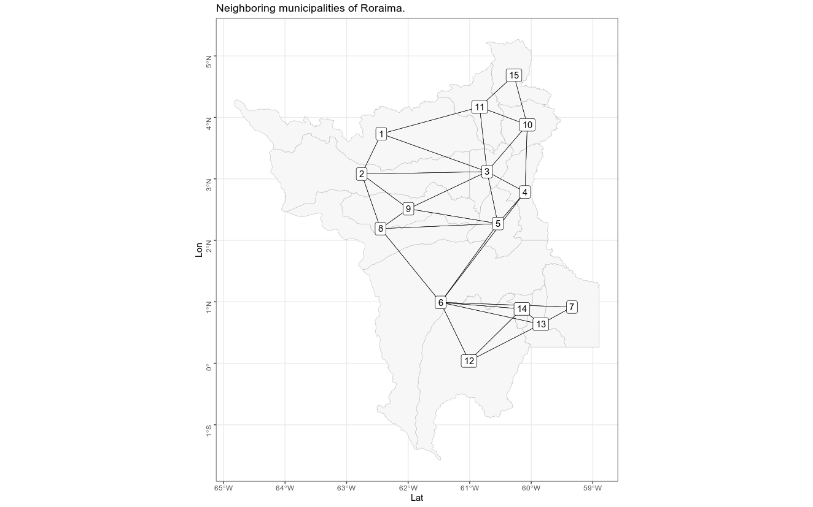

<!-- README.md is generated from README.Rmd. Please edit that file -->

# neighbor <a href='https://www.denis-or.com.br'></a>

<!-- badges: start -->
<!-- badges: end -->

## Overview

`{neighbor}` gets and visualizes the neighbors of a spatial object (area
objects) that has at least one point (or vertex) in common, but no
intersection. This package uses the `poly2nb` function from the `spdep`
package with the contiguity neighborhood type: queen and rook.

## Installation

And the development version from [GitHub](https://github.com/) with:

``` r
# install.packages("remotes")
remotes::install_github("denis-or/neighbor")

```

## Example

In this example, we are going to use the `geobr` package to get spatial data for 
Roraima, northern Brazil.

```{r}
library(neighbor)
library(geobr)
```


```{r}
rr <- geobr::read_municipality("RR")
```


Now we get the neighbors with the `get_neighbor` function:

```{r}
nb <- neighbor::get_neighbor(shapefile = rr, tipo = "Queen")
```

In the next step, we will visualize the map with the connections between the 
municipalities. Note that we have added the ggtitle element from the `ggplot`
package to the function.

```{r, fig.align = 'center', fig.width= 12, fig.height= 7}
neighbor::view_connections(nb) +
  ggplot2::ggtitle("Neighborhood of the municipalities of Roraima.")
```


We will also look at the neighboring municipalities named on the map.

```{r, fig.align = 'center', fig.width= 12, fig.height= 7}
neighbor::view_neighbor(nb) +
  ggplot2::ggtitle("Neighboring municipalities of Roraima.")
```


## Author

Denis de Oliveira Rodrigues - catoper@gmail.com

## License

`{neighbor}` is licensed under the MIT license. Check out
[LICENSE.md](https://github.com/denis-or/neighbor/blob/master/LICENSE.md)
for the full text.
